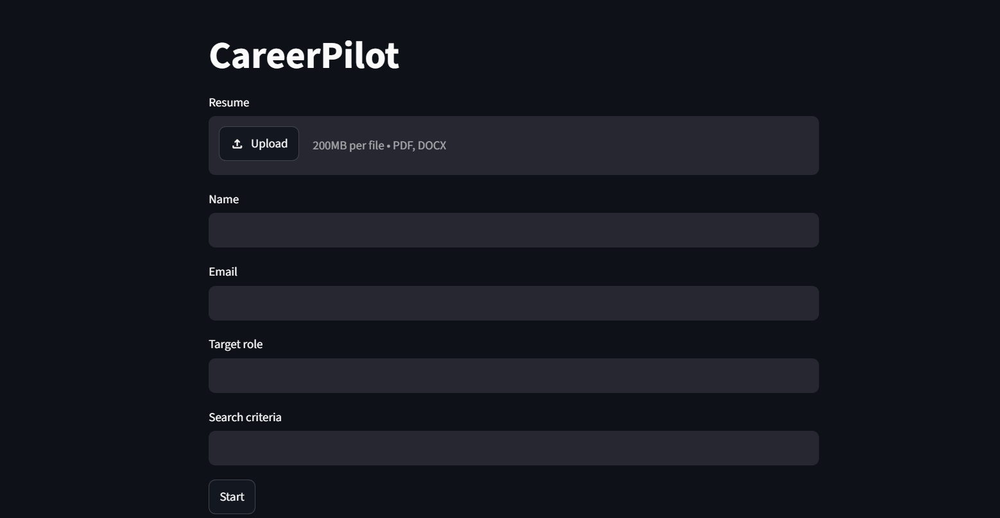
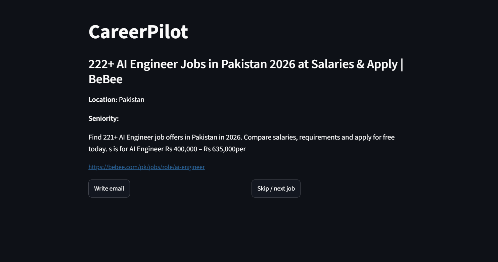
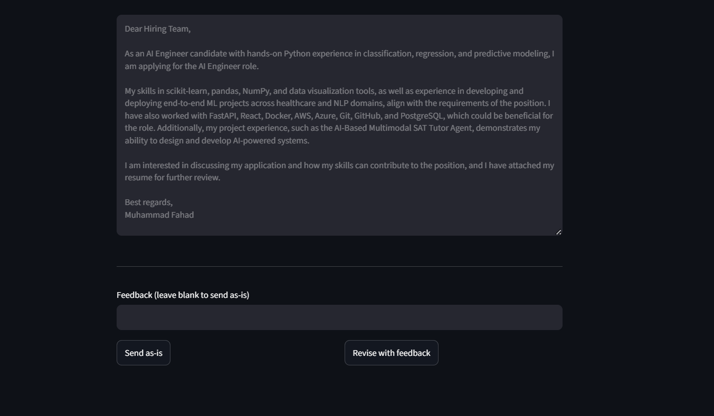
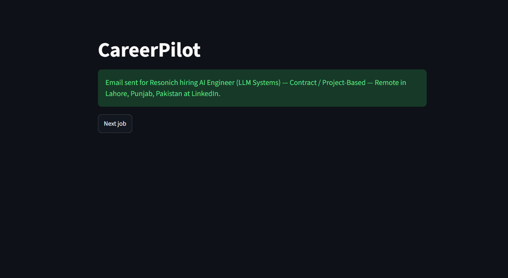

# CareerPilot

An autonomous job search and application agent built with LangGraph. CareerPilot searches for relevant job postings, drafts tailored application emails referencing your resume, and sends them only after you review and approve each one.

**Live demo:** [career-pilot-version1.streamlit.app](https://career-pilot-version1.streamlit.app)

---

## Table of Contents

- [Overview](#overview)
- [Key Features](#key-features)
- [Architecture](#architecture)
- [Tech Stack](#tech-stack)
- [Project Structure](#project-structure)
- [Prerequisites](#prerequisites)
- [Installation](#installation)
- [Configuration](#configuration)
- [Running Locally](#running-locally)
- [Deployment](#deployment)
- [Usage Guide](#usage-guide)
- [Database Schema](#database-schema)
- [Testing](#testing)
- [Design Notes](#design-notes)
- [Screenshots](#screenshots)
- [License](#license)

---

## Overview

CareerPilot is an AI agent, not a chatbot or a retrieval system. It reasons about a goal (finding and applying to relevant jobs), decides which tools to call and in what order, retains context across a session, and produces structured, verifiable output at every step.

The core design principle is **human-in-the-loop approval**. The agent never sends an application email without explicit review. It presents one job at a time, drafts an email, accepts feedback for revision, and only sends after the user approves.

---

## Key Features

- **Conversational, one-job-at-a-time flow** — the agent fetches a single matching job posting at a time rather than processing a batch, keeping each interaction fast and reviewable.
- **Resume-aware drafting** — every email is generated using the applicant's actual resume content and the specific job's requirements, not generic templates.
- **Iterative revision by feedback** — the user can request changes in plain language ("make it shorter", "add more detail on my ML experience") and the agent rewrites the draft accordingly, rather than requiring manual text editing.
- **Human approval before sending** — no email is sent without an explicit approval action from the user.
- **Resume attachment** — the applicant's resume is attached to every sent email.
- **Persistent memory** — session state (current job, current draft, jobs already shown) is stored in Postgres and keyed to the applicant's email, so closing and reopening the app resumes exactly where the user left off.
- **Structured output throughout** — job listings and email drafts are parsed into strict Pydantic schemas via structured LLM output, not manual JSON parsing.
- **External tool integration** — web search, a relational database, a spreadsheet tracker, and an email API are all integrated as agent tools.
- **Error handling and logging** — failures in any external call (search, LLM, database, email) are caught and logged without crashing the session.

---

## Architecture

The agent is built as a set of discrete, callable steps rather than a single linear pipeline, since the interaction is user-driven (each button click triggers exactly one step) rather than a fire-and-forget batch process.

```
 Resume Upload
      |
      v
 Applicant Intake  ----------------->  Postgres (applicants)
      |
      v
 Fetch One Job  <-------------------  Tavily Web Search
      |                                Structured extraction (Pydantic)
      v                                Location and duplicate filtering
 Draft Email  <----------------------  LLM (Groq)
      |                                Structured output (EmailDraft schema)
      v
 [ Human Review ]
   |         |
   | approve | request revision
   v         v
 Send Email  Draft Email (revise with feedback)
      |
      v
 Gmail API (send + attach resume)
 Postgres (applications, jobs)
 Google Sheets (tracking log)
```

Session state — including the current job, the current draft, and the list of jobs already shown to the user — persists in a dedicated Postgres table keyed by a hash of the applicant's email, so progress survives page reloads and repeat visits.

---

## Tech Stack

| Component | Choice | Purpose |
|---|---|---|
| Agent orchestration | LangChain / LangGraph | Reasoning steps, structured output, tool calling |
| LLM | Groq (Llama 3.3 70B) | Job extraction, email drafting and revision |
| Web search | Tavily API | Sourcing job postings |
| Database | PostgreSQL (Supabase) | Applicants, jobs, applications, session state |
| Spreadsheet tracking | Google Sheets API | Human-readable application log |
| Email | Gmail API (OAuth) | Sending applications with resume attached |
| Output validation | Pydantic | Structured job listings and email drafts |
| UI | Streamlit | Human-in-the-loop review and approval interface |
| Deployment | Streamlit Community Cloud | Hosting the UI |

---

## Project Structure

```
careerpilot/
├── config/
│   ├── settings.py            environment variable loading
│   └── decode_secrets.py      decodes base64 secrets on Streamlit Cloud
├── schemas/
│   └── models.py               Pydantic models: ApplicantProfile, JobListing, EmailDraft, AgentState
├── prompts/
│   ├── system_prompt.py
│   ├── extraction_prompt.py
│   └── email_prompt.py
├── tools/
│   ├── resume_reader.py        PDF/DOCX resume parsing
│   ├── web_search.py           Tavily search wrapper
│   ├── db_tool.py               Postgres queries (applicants, jobs, applications, sessions)
│   ├── sheets_tool.py            Google Sheets logging
│   └── gmail_tool.py              Gmail send with attachment support
├── graph/
│   ├── nodes.py                    fetch_one_job, draft_or_revise_email, send_current_email
│   ├── edges.py                     routing helpers
│   └── build_graph.py                 shared graph/connection setup
├── ui/
│   └── app.py                          Streamlit application
├── tests/
│   └── test_scenarios.py                pytest test cases
├── main.py
├── requirements.txt
├── .env.example
└── README.md
```

---

## Prerequisites

- Python 3.11 or later
- A Supabase account (managed Postgres)
- A Tavily account (web search API)
- A Groq account (LLM API)
- A Google Cloud project with the Sheets API and Gmail API enabled

---

## Installation

Clone the repository:

```
git clone https://github.com/fahadhmughal/Career_Pilot.git
cd Career_Pilot
```

Create and activate a virtual environment:

```
python -m venv venv
venv\Scripts\activate
```

Install dependencies:

```
pip install -r requirements.txt
```

---

## Configuration

Copy the example environment file and fill in real values:

```
copy .env.example .env
```

| Variable | Description |
|---|---|
| `DATABASE_URL` | Supabase Postgres connection string (session pooler, port 5432) |
| `TAVILY_API_KEY` | Tavily web search API key |
| `GROQ_API_KEY` | Groq LLM API key |
| `SHEET_ID` | Google Sheet ID used for application tracking |
| `GOOGLE_SERVICE_ACCOUNT_FILE` | Path to the Google service account JSON key file |
| `GMAIL_CREDENTIALS_FILE` | Path to the Gmail OAuth client credentials JSON file |

Required local files (not committed to version control):

- `service-account.json` — Google service account key, shared as an editor on the tracking sheet
- `credentials.json` — Gmail OAuth client credentials
- `token.json` — generated automatically on first Gmail authentication

Database schema setup: run the SQL in the project's schema file against the Supabase SQL editor before first use.

---

## Running Locally

Start the Streamlit interface:

```
streamlit run ui/app.py
```

The app opens at `http://localhost:8501`. Upload a resume, provide applicant details and search criteria, and begin the review flow.

---

## Deployment

The application is deployed on Streamlit Community Cloud, connected directly to this repository.

Because the hosting environment has no persistent local disk and cannot complete an interactive OAuth browser flow, the Gmail and Google Sheets credentials are provided as base64-encoded secrets and decoded to disk at application startup. Secrets are configured under the app's Settings > Secrets panel on Streamlit Cloud and are not present anywhere in this repository.

---

## Usage Guide

1. Upload a resume (PDF or DOCX).
2. Provide name, email, target role, and search criteria.
3. The agent presents one matching job posting with its title, company, location, and requirements.
4. Select "Write email" to generate a draft referencing the resume and the specific job.
5. Review the draft. To request changes, enter feedback in plain language and select "Revise with feedback". Repeat until satisfied.
6. Select "Send as-is" to send the approved email, with the resume attached, to the job's contact address.
7. Select "Next job" to review another posting. Jobs already shown or already applied to are not repeated.

---

## Database Schema

| Table | Purpose |
|---|---|
| `applicants` | One row per applicant, keyed uniquely by email |
| `jobs` | Job postings discovered by the agent |
| `applications` | Sent or drafted applications, linking applicants to jobs |
| `agent_sessions` | Persisted conversational state per applicant, enabling resume across sessions |

---

## Testing

Run the test suite with:

```
pytest tests/
```

Tests cover a normal successful run, empty search results, malformed extraction output, and email send failures, with all external calls mocked.

---

## Design Notes

**Why one job at a time instead of a batch.** An earlier version of this project fetched and drafted for several jobs simultaneously before presenting them for review. This was slower, harder to review meaningfully, and made revision awkward. Processing one job at a time keeps each interaction fast, keeps the review focused, and matches how a person actually evaluates opportunities.

**Why feedback triggers a rewrite rather than manual editing.** Manual text editing turns the tool into a text editor with extra steps. Having the agent incorporate feedback into a fresh draft keeps the interaction agentic and demonstrates iterative reasoning rather than static templating.

**Why sends require explicit approval.** Automatically emailing recruiters or companies without review carries real risk of factual errors or tone problems reaching a real person. Requiring approval keeps a human accountable for what is actually sent.

---

## Screenshots

Screenshots are stored in the `screenshots/` folder and referenced below.






---

## License

This project is provided for educational and portfolio purposes.
